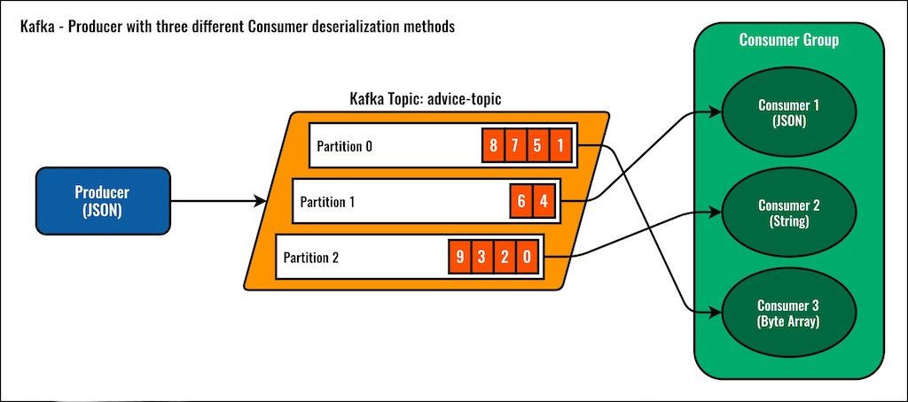

# Broker client

A Slow Event Streaming client for Git


## Motivation

`Lego Mindstorms EV3` is the first programmable brick which it is able to run a `Linux OS` inside, and
it has `Internet connection capabilities`. Using the Brick, you can develop educational robots which
run software to manage `data` from Sensors & Actuators. In the ecosystem you could find many awesome examples
but it is not common to use the bricks in a remote way, and it is hard to find Bricks communicating each others outside
of your local network.

In real world, large distributed systems implements Event-Driven architectures (EDA)
and Streaming architectures to manage a huge amount of data to solve problems.

Why not explore with the help of Bricks the development of some examples to `"imitate"` some architectural patterns
with Bricks?

## Why Git?

`Git` is a free and open source distributed version control system. On Internet exist some companies
which offer `free` git accounts to store the code.

**Why not use a Git repository as a persistant event storage for your events?**

## What components are common in a Streaming platform?

- The publisher
- The consumer
- The partitions
- The events
- The topics



## Features included with the client:

- Publish Events
- Consume Events
- Initial partition support

## Examples

``` java
@Slf4j
public class BrokerClientMultiThreadTests {

    @Test
    public void given_Client_when_produceAndConsumeInParallelForEvent_then_Ok() {

        var futureRequests = List.of(new Client1(), new Client2()).stream()
            .map(Client::runAsync)
            .collect(toList());

        var results = futureRequests.stream()
            .map(CompletableFuture::join)
            .collect(toList());

        then(results.stream().count()).isEqualTo(2);
    }

    private interface Client {

        Logger LOGGER = LoggerFactory.getLogger(Client.class);

        Integer run();

        default CompletableFuture<Integer> runAsync() {

            LOGGER.info("Thread: {}", Thread.currentThread().getName());
            CompletableFuture<Integer> future = CompletableFuture
                .supplyAsync(() -> run())
                .exceptionally(ex -> {
                    LOGGER.error(ex.getLocalizedMessage(), ex);
                    return 0;
                })
                .completeOnTimeout(0, 50, TimeUnit.SECONDS);

            return future;
        }
    }

    @Slf4j
    private static class Client1 implements Client {

        private BrokerClientConfig defaultConfig;
        private BrokerClient defaultBrokerClient;
        private String EVENT = "PING";

        public Client1() {
            defaultConfig = new BrokerClientConfig("config_ping.properties");
            defaultBrokerClient = new BrokerClient(defaultConfig);
        }

        public Integer run() {
            LOGGER.info("CLIENT 1");

            sleep(2);
            IntStream.rangeClosed(1, 3)
                .forEach(x -> {
                    sleep(3);
                    defaultBrokerClient.produce(EVENT, "");
                });
            return 1;
        }

        @SneakyThrows
        private void sleep(int seconds) {
            Thread.sleep(seconds * 1000);
        }

    }

    @Slf4j
    private static class Client2 implements Client {

        final int poolingPeriod = 1;

        private BrokerClientConfig defaultConfig;
        private BrokerClient defaultBrokerClient;
        private String EVENT = "PING";

        public Client2() {
            defaultConfig = new BrokerClientConfig("config_pong.properties");
            defaultBrokerClient = new BrokerClient(defaultConfig);
        }

        public Integer run() {
            LOGGER.info("CLIENT 2");
            IntStream.rangeClosed(1, 3)
                .forEach(x -> defaultBrokerClient.consume(EVENT, poolingPeriod));
            return 1;
        }

    }
}

```

## Configuration

You can declare the client in a Java class or use a PropertyFile.

```
brokerclient.broker=https://github.com/broker-game/broker-dev-environment
brokerclient.application=PINGPONG
brokerclient.node=PING-NODE
brokerclient.fullname=Juan Antonio Breña Moral
brokerclient.email=bren@juanantonio.info
brokerclient.user=XXX
brokerclient.password=YYY
```

**Note:** the client support configuration for multiple clients in the same file.
Review the tests to learn the way.


## Dependency

```
<repositories>
    <repository>
        <id>jitpack.io</id>
        <url>https://jitpack.io</url>
    </repository>
</repositories>
```

```
<dependency>
    <groupId>com.github.broker-game</groupId>
    <artifactId>broker-client</artifactId>
    <version>0.2.0-SNAPSHOT</version>
</dependency>
```

## How to build the project?

```
mvn clean test

# Generate Checkstyle report
mvn clean site -DskipTests
```
